# Let's start!

---

Welcome! In today’s workshop, we will explore how to get from raw text data to an annotated dataset using a Python pipeline for preprocessing and INCEpTION for annotation.
Before the workshop, you were asked to download and install Python and, if you wish, install PyCharm or another text editor. Another important preparation step is to clone or download the GitHub repository that I created during my PhD. You can find it [here](https://github.com/helwed/Academic-Literacy-in-German).

## How do I download the GitHub repository?
To download the GitHub repository, click the green “Code” button and then select “Download ZIP”, as shown in the screenshot below.

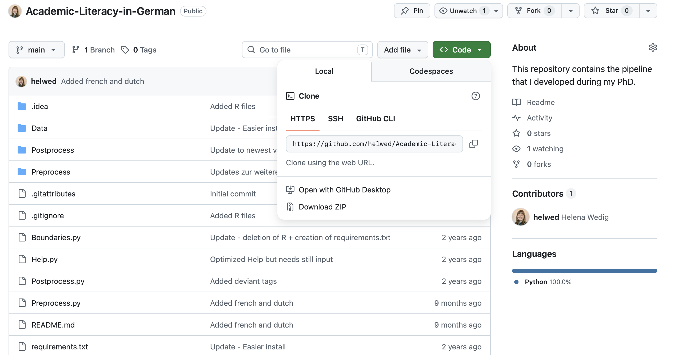

After downloading the folder, you can unpack it in a location of your choice—ideally in a local folder, not on SharePoint or another cloud service.

## How do I clone a GitHub repository?
To clone a GitHub repository, you need to have a GitHub account. You do not need one for today’s workshop, since we can also just download the repository, but I strongly recommend using version control (and Git) during your PhD. Cloning the repository and regularly pulling the latest version allows you to benefit from updates and bug fixes.

The “easiest” way to manage GitHub repositories is with GitHub Desktop, but since it requires installing an application, this may not be allowed on managed university computers. Instead, you can use the command line: first navigate to a folder of your choice using cd (e.g., cd Documents) and then type the following command:

`git clone https://github.com/helwed/Academic-Literacy-in-German.git`

## I downloaded the folder! What now?

After cloning or downloading, you should see a new folder with the name "Academic-Literacy-in-German". I advice you to save it in your local Documents folder.

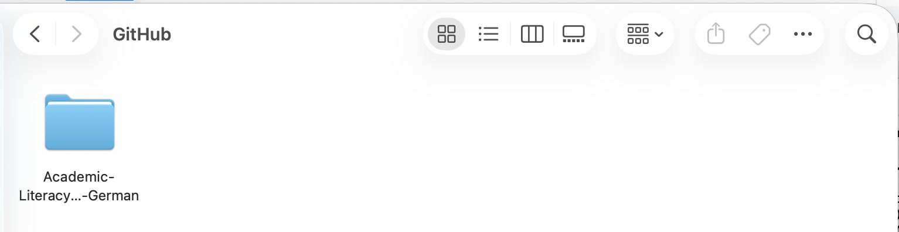

Now that we have the repository, we can start “installing” the pipeline. 

### Windows - Download PyCharm
To prevent multiple windows error messages, download and install PyCharm (Community Edition) [Link](https://www.jetbrains.com/pycharm).

Then open the folder in PyCharm (Click on `Open...`)

Click in the lower right corner on `<No interpeter>` choose `Add New Interpreter > Add Local Interpreter`, choose a virtual environment (make sure it's Python 3.14) click on `Ok`. 

::: {.callout-note}
If you get an error message, try using `Type : Conda` and then `Install Miniconda`. Choose the newest Python version.
:::

Go to `Python Packages` in the lower left corner (third icon). Look for `spacy`. Click `install`. You might need to look for an install button on the right side.

If you need to upgrade pip, use the command `python.exe -m pip install --upgrade pip` in the terminal on the left within PyCharm (sixth icon). 

::: {.callout-note}
If you see any other error message plopping up that say that a module needs to be installed, look for that module in Python packages again (or follow the proposed link from PyCharm).
:::

Open the terminal on the left within PyCharm (sixth icon), and use the following commands to download one (or all) of the following language models:

- German: `python -m spacy download de_core_news_sm`
- French: `python -m spacy download fr_core_news_sm`
- Dutch: `python -m spacy download nl_core_news_sm`
- English: `python -m spacy download en_core_web_sm`
- Swedish: `python -m spacy download sv_core_news_sm`

You then create a folder with the name of your corpus (without spaces) in the subfolder `Data` found in `Academic-Literacy-in-German`. Following, you paste your raw text data in a subfolder called raw.

### Mac and Linux
For Mac and Linux, you can use the `cd` command in your terminal to locate your Academic-Literacy-in-German folder. `cd ..` allows you to step into the overarching folder, `ls` lists all subordinating folders.

If you saved the folder in Documents, you can try: `cd Documents` > `cd Academic-Literacy-in-German-main`

::: {.callout-tip}
If you use tabstopp after typing three characters, the command will be auto-completed.
:::

The first step is optional, as some of you may not have access to Conda. If you would like to learn how to use it, I recommend looking at some material I created previously [here](https://eur-nl.github.io/rs_training/IDEs.html#more-than-a-feature-virtual-environments). 

If you do not have (or do not want to have) conda, you can also directly type `python -m venv Academic-Literacy-in-German` in your command line. After that, you activate it using `source Academic-Literacy-in-German/bin/activate` and you install the needed packages using `pip install -r requirements.txt`.

Now, let us not forget to download the language model:

- German: `python -m spacy download de_core_news_sm`
- French: `python -m spacy download fr_core_news_sm`
- Dutch: `python -m spacy download nl_core_news_sm`
- English: `python -m spacy download en_core_web_sm`

You then create a folder with the name of your corpus (without spaces) in the subfolder `Data` found in `Academic-Literacy-in-German`. Following, you paste your raw text data in a subfolder called raw.

Preprocessing
---

To preprocess your raw data, it is important that it is stored in `.txt` files, similar to the text shown in the screenshot below.

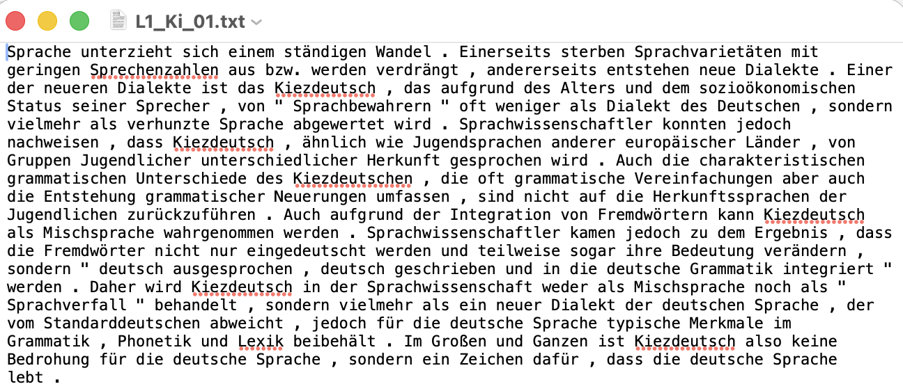

After placing your raw text files in the folder, you can start the preprocessing pipeline by running the command:

`python preprocess.py` or navigate to the preprocess.py file in PyCharm and click the play button in the upper right corner.

The program will then guide you through the process.

It will look similar to this:
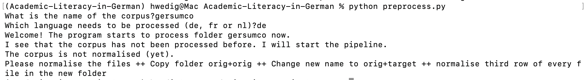

Your folder structure should now look like this:
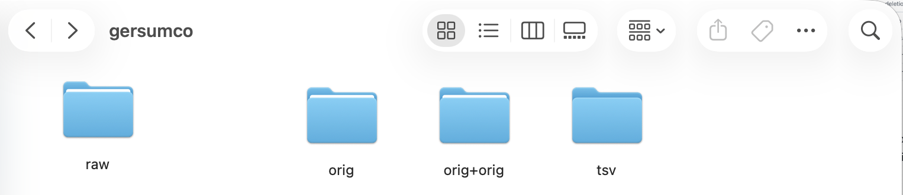

In addition, the program will ask you to add an `orig+target` folder to the directory.

To do this, you can copy the `orig+orig` folder and rename it to `orig+target`.

## Normalize your data!

Now, you can manually normalize your data. To do this, open each file and edit the second word in each line. The first word (before the tab) is the `orig`.

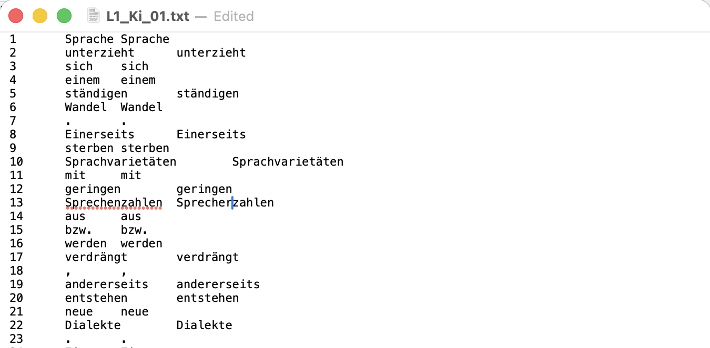

*Do you notice that some words have not been correctly separated?* Now is your chance to fix that.

*Do you assume that no mistakes were made?* Then you can skip this step (but still create the `orig+target` copy).

After normalizing the data, you can run `preprocess.py` or navigate to the preprocess.py file in PyCharm and click the play button in the upper right corner again.

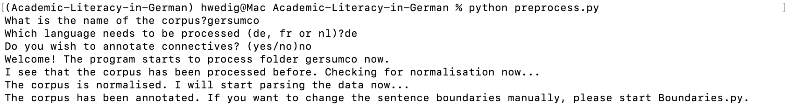

## Exercises - Preprocessing
### Exercise 1a
Download the test data that was provided by the "European Parliament Proceedings Parallel Corpus 1996-2011" (Koehn, 2005) [here](media/europarl_workshop.txt). I added some changes for the purpose of this course. Find the original data [here](https://www.statmt.org/wmt06/shared-task/) 
Take the text file, follow the described steps and start the normalization process. Work through a minimum of 30 token.

###  Exercise 1b
Create a text file (in utf-8 encoding) and write a few sentences in it. Go through the process with your text file.

## Adapt sentence boundaries!

Did you look at your data and notice that some sentence boundaries were not detected correctly? You can adjust them now using `boundaries.py`. To do this, run:

`python boundaries.py` or navigate to the boundaries.py file in PyCharm and click the play button in the upper right corner.

The program will guide you through the process.

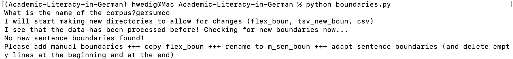

You now have to add new boundaries to `m_sen_boun`. To do this, copy the `flex_boun` folder and rename it to `m_sen_boun`. After that, you can change the boundaries by moving the empty lines: deleting an empty line connects two sentences, while inserting a new empty line separates two parts.

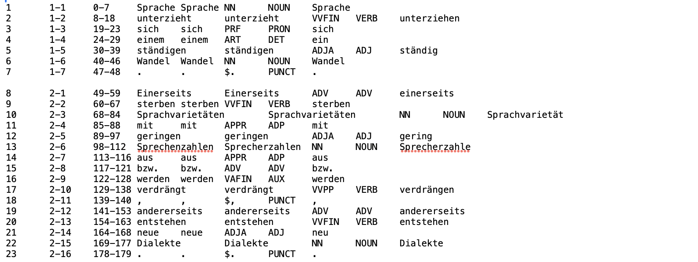

After adapting the sentence boundaries, run `boundaries.py` or navigate to the boundaries.py file in PyCharm and click the play button in the upper right corner again.

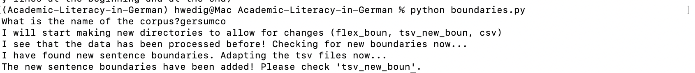

After this step, your data has been successfully preprocessed.

## Exercises - Sentence Boundaries
### Exercise 2a

Take the output of the normalization and check whether the sentence boundaries have been annotated correctly. Work through a minimum of three sentences

### Exercise 2b

Take the output of the normalization of your personal text files. Check whether the sentence boundaries have been annotated correctly and correct them if needed.

We are ready for INCEpTION!
---

Let's have a look at INCEpTION now that we have some data. You can access it using the following link:

[https://inception.flw.uantwerpen.be/login.html](https://inception.flw.uantwerpen.be/login.html)

I created accounts for everyone that did not have one yet. The username is the combination of your first letter and your last name (e.g. HWedig) and the password is your firstname,  today and "inception" (e.g., Helena26062026inception). 

Once you log in, your INCEpTION instance should look similar to this:
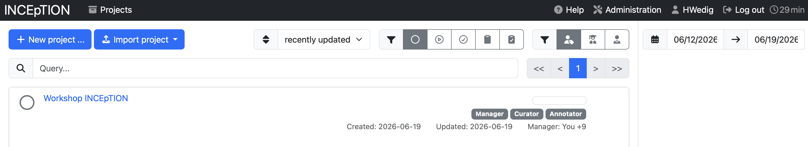

I created a shared project for all of us and made you managers there, so we can explore all functionalities together. 

This is how your overview should look like after clicking on the project:
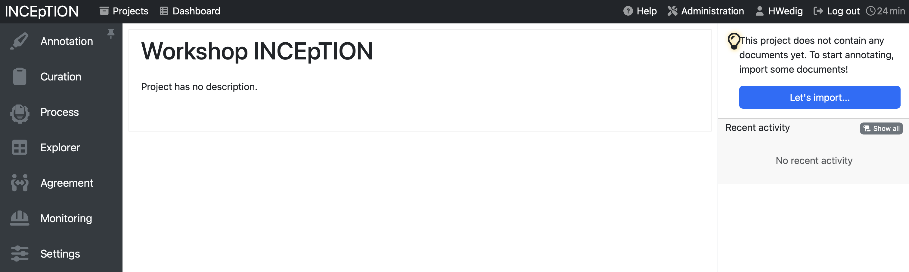

## Manage your project

### Upload your data 
* see [here](https://inception-project.github.io/releases/40.6/docs/user-guide.html#documents_in_getting_started) for the official documentation

To upload your data, click on `Settings` and then on `Documents`. Click in the field after `Files to import` to select the files and folders you want to upload. If you want to upload the preprocessed data that we prepared today, choose the format `WebAnno TSV 3.3`, but it is also possible to upload other formats.

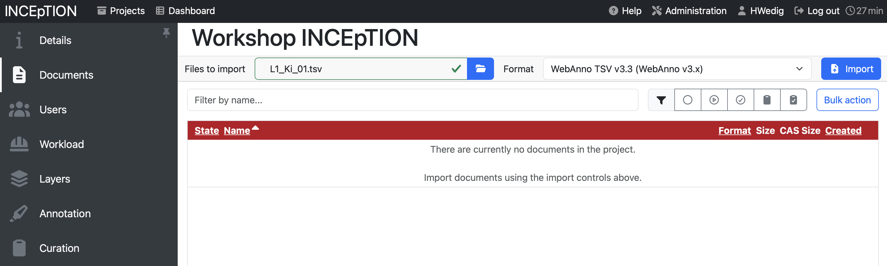

If you already have pre-annotated data, make sure that the corresponding annotation layers are defined under `Layers` and that the tags you use are listed under `Tags`; otherwise, INCEpTION will reject the upload.

### Adding Layers 

* see [here](https://inception-project.github.io/releases/40.6/docs/user-guide.html#sect_projects_layers) for the official documentation

To add a new layer, you can click on the section `Layers` in the project management environment. Here, you see pre-defined categories, but also the option to `Create` a new one. 

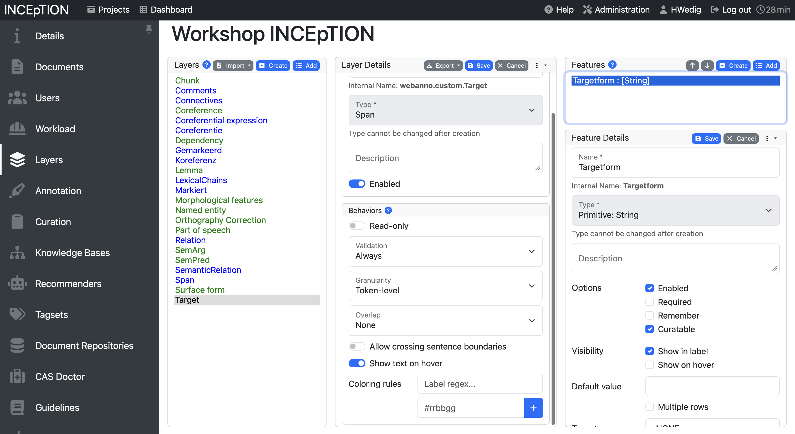

When creating a layer, you can choose between multiple types: Span, Chain, Relation and Document Metadata. 

- A **span** to annotate continuous segments of text
- A **relation** to annotate relations between spans
- A **chain** to annotate directed sequences of connected spans
- A **document metadata layer** to annotate document-level information

Additionally, you can influence the behavior:

- **Validation** allows to check whether annotations exist which are not conforming to the current behavior settings
- **Granularity** influences how long/broad the spans can be. If it is set to character-level, annotations can be created anywhere. Token-level limits annotations to full tokens and sentence-level to full sentences. 
- **Overlap** allows to limit the overlapping of spans. Stacking would mean that two annotations span over one full segment, overlapping on the other side means that they are not fully covering the same segment, but overlap on part of it.
- You can also allow annotations to cross **sentence boundaries** which is handy for chains and relations.

The **features** on the right-hand side allow to set how the layer is annotated. If the type is set as string, for example, you can annotate the token with a string. You can also decide to create links here, to use numbers or a knowledge base. Inception offers a detailed description [here](https://inception-project.github.io/releases/40.6/docs/user-guide.html#sect_projects_layers_features). For us, it is important to know that we can link our tagsets with the layers here using the setting "tagset".

### Adding Tags 
* see [here](https://inception-project.github.io/releases/40.6/docs/user-guide.html#sect_projects_tagsets158) for the official documentation

Usually you want to annotate your data with your own self-developed tagset. To do so, you have to create the tagset in the **Tagset** pane. By clicking **Create**, you get the option to define a name, a language and write a description for your overarching tagset. After that, you can create new tags by  giving them a name and adding a description. While you do not need to add a description to create a tag, it will be shown to you while annotating which might help to remind you what the tag entails.

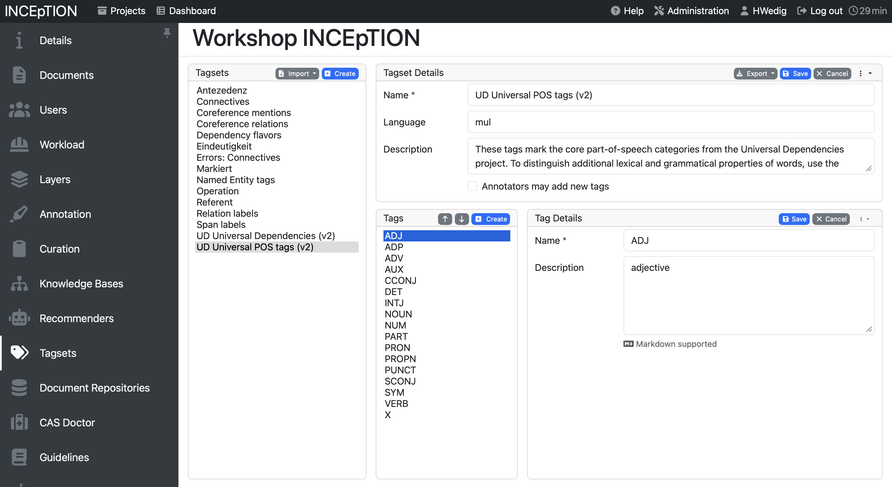

### Linking tagsets to layers

You can link tagsets to layers by adding them in the features of a layer, similar to what is seen on the screenshot below:

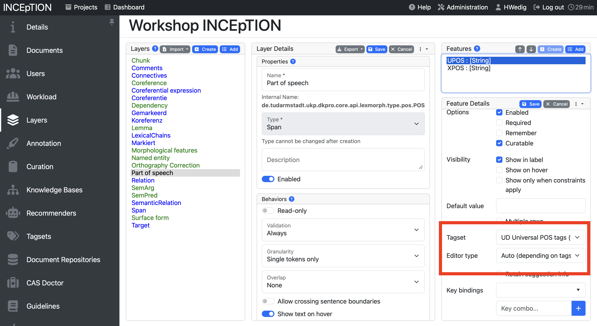

## Exercises - Project Management
### Exercise 3a
Everyone gets an annotation layer and a tagset to add to Inception. Add it to the shared project.

### Exercise 3b
Upload your text file (as tsv) to Inception.

## Annotate your data 
* see [here](https://inception-project.github.io/releases/40.6/docs/user-guide.html#sect_annotation35) for the official documentation

To annotate your data, you need to open one of your documents. You can choose one in this document overview:

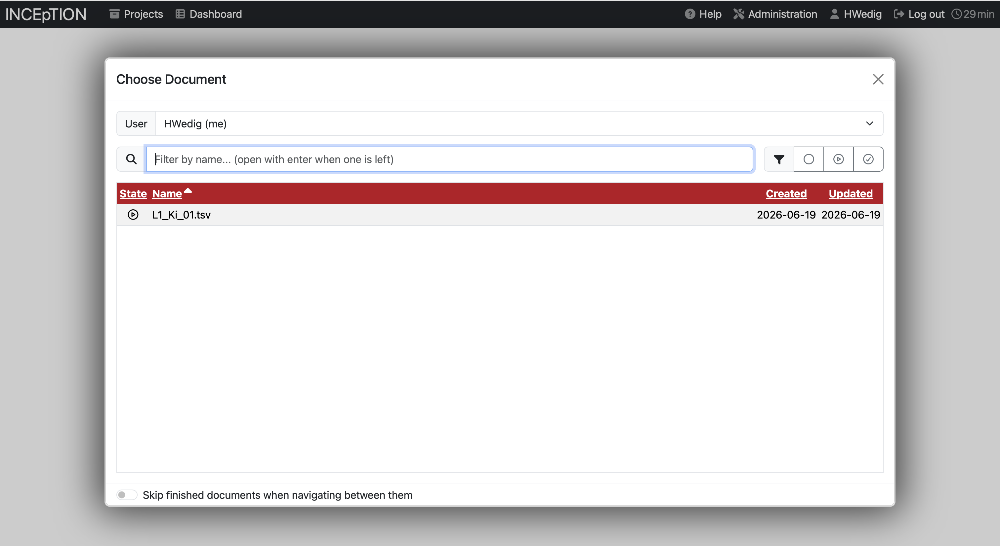

Once the document is open, it will look like this:

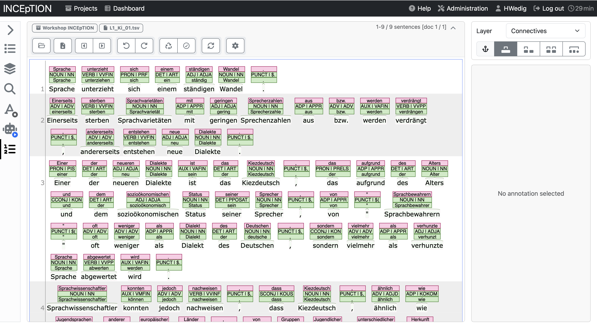

You can see multiple functionalities here.
The upper pane above the text allows you to...

- ...browse your files 
- ...export the specific document
- ...switch between documents
- ...undo and redo actions
- ...reset the document
- ...mark the annotation as completed
- ...refresh the document
- ...and open preferences

The pane on the left allows you to...

- ...list the annotations
- ...have a look at the layers
- ...search the document
- ...use [active learning](https://inception-project.github.io/releases/40.6/docs/user-guide.html#sect_annotation_activeLearning)
- ...use a [recommender](https://inception-project.github.io/releases/40.6/docs/user-guide.html#sect_annotation_recommendation65)
- ...and have a look at [statistics](https://inception-project.github.io/releases/40.6/docs/user-guide.html#sect_statistics)

To annotate you will mainly work with the big middle text pane. Here, the text is displayed and the annotations can be added. Let's have a look how to annotate spans first.

### Annotating spans

There are multiple ways to annotate token depending on the granularity that was set for the layer. In most cases you can use your mouse to select a span to annotate. It is advised to pay attention to the range of the span that is selected, since single characters can get unselected in the process.

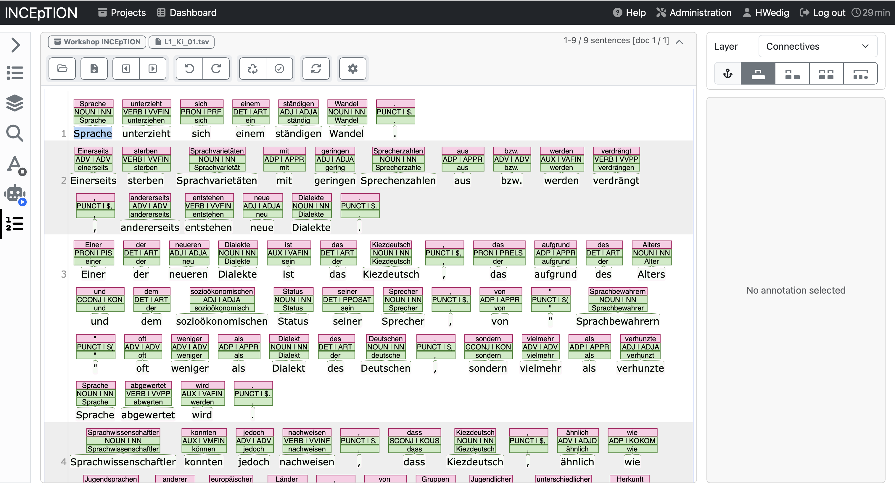

Once a span is selected, and you let go of the mouse, an annotation window opens on the right-hand side.

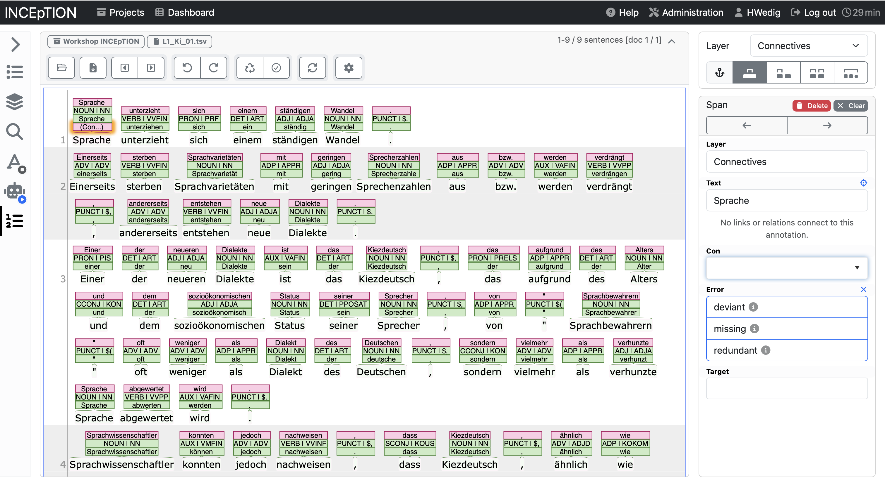

In the example below, you see the options for the Connective tagset. The annotation category *Con* allows to add the type of connective, error allows to annotate whether it is an error and target which would be the correct form.

Let's have a look at how it looks like in the annotated form.

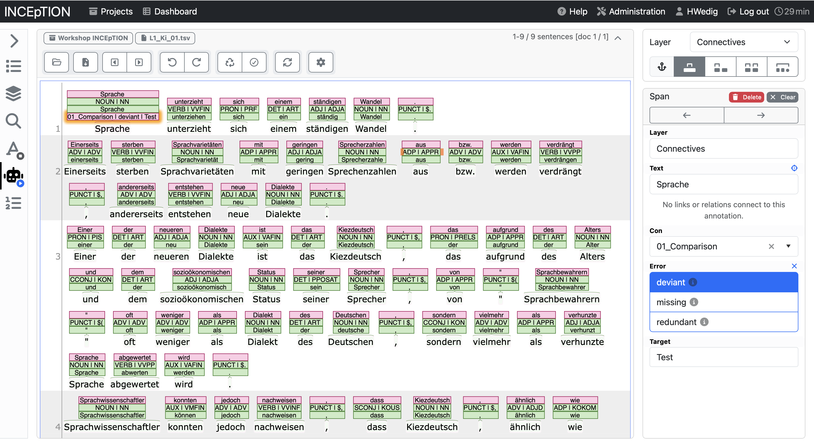

You can see that by filling in the annotation on the right side, the annotation has been added to the token in the middle text field. In this way, you can work and add every layer that you defined and build your own annotated corpus.

### Annotating chains and relations

Another kind of annotation that might be relevant to you are chains and relations. The difference between the two is that chain elements depend on each other and are leading back to one element at the beginning of the chain while relations are mostly between two elements.

To annotate a relation or a chain you have to click on an already annotated element and then drag it to another element. An arrow will help you visualize this movement.

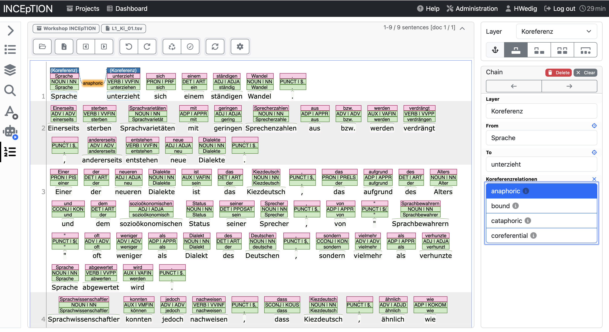

After marking the relation you can annotate what kind of relation it is. Afterward, it will be shown between (or above) the two elements.

## Exercises - Annotation
### Exercise 4a
Annotate the europarl.txt document with your layer and tagset according to the guidelines that you can find [online](https://universaldependencies.org/u/feat/index.html). You are now the "expert" of your layer.

### Exercise 4b
Depending on the time, we will do this in four rounds (in a group of four):
1. Sit together and decide which of the four layers you want to annotate. The "expert" explains the annotation layer and the tagset.
2. Sit away from each other: Annotate the text document that the "expert" of that specific layer had uploaded.

If we have enough time, we can do this for every annotation layer.

## Curating annotations 

* see [here](https://inception-project.github.io/releases/40.6/docs/user-guide.html#sect_curation80) for the official documentation

To allow for the highest quality annotation of your data, it is advice to have multiple annotators work on one text and to curate the result afterward. Inception allows you to do that using the **Curation** pane.

In order to curate documents, they need to be marked as "finished" first. Afterward, you can open them and will see all annotations in one overview as seen below. 

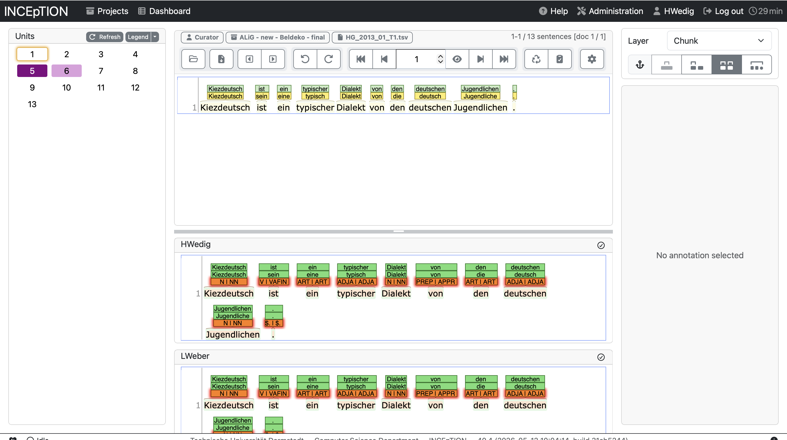

If the two versions differentiate from each other, the line will be highlighted on the left side. You can curate the result by clicking on the annotation that you seem as right. It will automatically be added to the curated version above.

### Calculate the annotation agreement

You can also use INCEpTION to have a look at the annotation agreement between annotators. To do so, you need to open the **Agreement** pane in the overview. You will have several options to calculate the agreement (e.g., only for finished documents). You can also have a look at the agreement per document or per annotator pair.

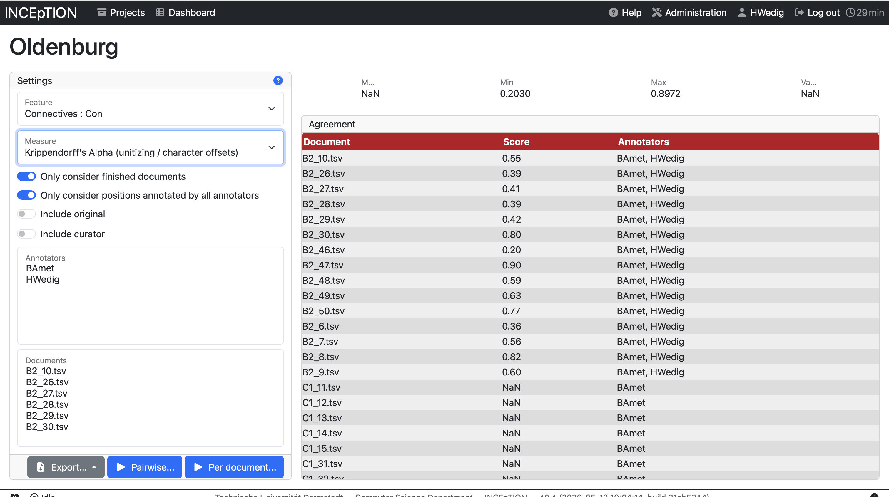

## Exercises - Curation and Agreement

### Exercise 5a
Sit together and curate the annotations that you made.

### Exercise 5b
Calculate your annotator agreement.

## Export your data

After annotation and curation you might want to export your data to perform data analyses. You can do that in the project management environment by clicking on **Export**. 

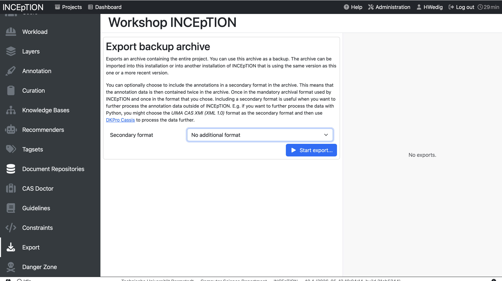

